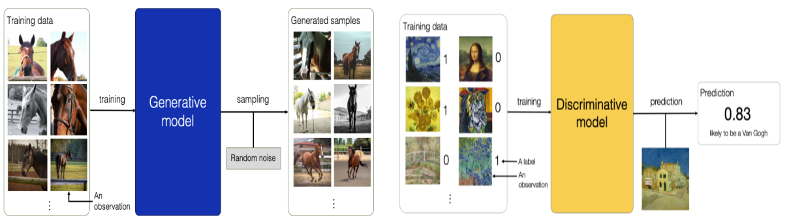

## Machine Learning Approaches: Discriminative vs. Generative

### Discriminative Learning
- **Definition**: Focuses on modeling the decision boundary between classes.
- **Goal**: Directly predicts the probability of a label given an input.
- **Examples**: In a fraud detection this model can classify the transactions as leigitmate or fraudulent.
    **Amazon**: Amazon uses discriminative AI to recommend products to its customers. The company's recommendation engine analyzes a customer's past purchases and browsing history to identify products that they are likely to be interested in. This use of discriminative AI has helped Amazon to increase sales and customer satisfaction.

    **Facebook**: Facebook uses discriminative AI to filter out spam and hate speech from its users' feeds. The company's software uses a variety of techniques, including natural language processing and machine learning, to identify and remove content that is deemed to be offensive or harmful.

    **Google Search**: Google Search uses discriminative AI to return the most relevant results to its users' search queries. The company's search engine uses a variety of techniques, including natural language processing and machine learning, to rank websites based on their relevance to the user's query.

    **Apple Siri**: Apple Siri uses discriminative AI to understand and respond to its users' voice commands. The company's software uses a variety of techniques, including natural language processing and machine learning, to identify the user's intent and provide the most appropriate response.

    **Tesla Autopilot**: Tesla Autopilot uses discriminative AI to enable its cars to drive themselves. The company's software uses a variety of techniques, including computer vision and machine learning, to identify objects on the road and make decisions about how to control the car.

### Generative Learning
- **Definition**: Models the distribution of individual classes.
- **Goal**: Learns how the data is generated by estimating the joint probability of the input and the label.
- **Examples**: Language models that can generate text
    **Netflix**: Netflix uses generative AI to recommend movies and TV shows to its users. The company's recommendation engine analyzes a user's past viewing history and preferences to generate a list of personalized recommendations. This use of generative AI has helped Netflix to increase user engagement and satisfaction.

    **Spotify**: Spotify uses generative AI to create personalized playlists for its users. The company's recommendation engine analyzes a user's listening history and preferences to generate playlists that are tailored to their individual tastes. This use of generative AI has helped Spotify to increase user engagement and retention.

    **Grammarly**: Grammarly uses generative AI to help users improve their writing. The company's software uses a variety of techniques, including natural language processing and machine learning, to identify and correct grammatical errors, suggest improvements to style and clarity, and provide feedback on the overall tone and effectiveness of writing.

    **Adobe Creative Cloud**: Adobe Creative Cloud uses generative AI to help users create professional-looking designs. The company's software uses a variety of techniques, including natural language processing and machine learning, to generate design ideas, create prototypes, and suggest improvements to existing designs.
    
    **Salesforce Einstein**: Salesforce Einstein uses generative AI to help sales teams identify and close deals. The company's software uses a variety of techniques, including natural language processing and machine learning, to analyze customer data, identify potential leads, and recommend the best course of action for closing deals.

### Key Differences
- **Discriminative**: P(y|x) - Probability of label given input.
- **Generative**: P(x, y) - Joint probability of input and label.

### References
- [Generative vs Discriminative Models Examples](https://vitalflux.com/generative-vs-discriminative-models-examples/)
