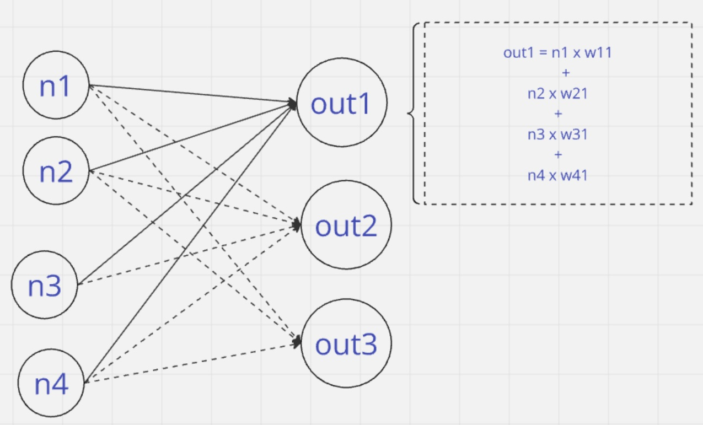

# What makes GenAI so powerful?

There are 3 key factors:
1. Data
2. Model Capacity
3. Compute

## Data
An ML model's effectiveness depends on its training data. Generative AI models, particularly those leveraging self-supervised learning, can learn from vast amounts of unlabeled data. This approach allows the model to understand patterns and structures within the data without explicit labels, making it more efficient and scalable. Self-supervised learning has been a game-changer, enabling models to improve their performance by leveraging the abundance of available data without the need for extensive manual labeling.

## Model Capacity
Model capacity in the context of machine learning, particularly for large language models, is often defined by two key metrics: the number of parameters and the FLOP (Floating Point Operations) count.

- **Number of Parameters**: This refers to the total number of trainable weights in the model. For example, GPT-3 has 175 billion parameters, while GPT-4 has even more. The number of parameters is a direct indicator of the model's complexity and its ability to learn from data.

- **FLOP Count**: FLOPs measure the computational effort required to perform a forward pass through the model. It represents the number of floating-point operations needed to process a single input. Higher FLOP counts generally indicate more computationally intensive models, which can lead to better performance but also require more resources.

To understand FLOP Count consider the above single Neuron with 4 input and 3 output neurons. Each output is computed by multiplying the inputs neurons and their corresponding weight and summing them up. This results in 4 multiplications and 3 additons for each output neuron. Therefore, total FLOPs are 3 x (4 + 3) = 21.

Open AI GPT-3 has 175 billion parameters and requires a significant number of FLOPs for both training and inference.
For example, it requires approximately 3.14×10^ 23 FLOPs (floating-point operations) for training.
Google PALM-2 was trained using 10^23 FLOPS.

## Compute
For example, Training GPT-4 required an immense amount of computational power, measured in floating-point operations per second (FLOPS).
Here’s an overview of the process
    GPUs Used: Approximately 25,000 NVIDIA A100 GPUs were used for training.
    Training Duration: The training process took about 90 to 100 days.
    Total FLOPS: The total training FLOPS for GPT-4 is estimated to be around 2.15 × 10^ 25
    GPT-4 was trained on a vast dataset of approximately 13 trillion tokens
    The estimated cost for training GPT-4 was around $63 million, considering the GPU usage and duration.

